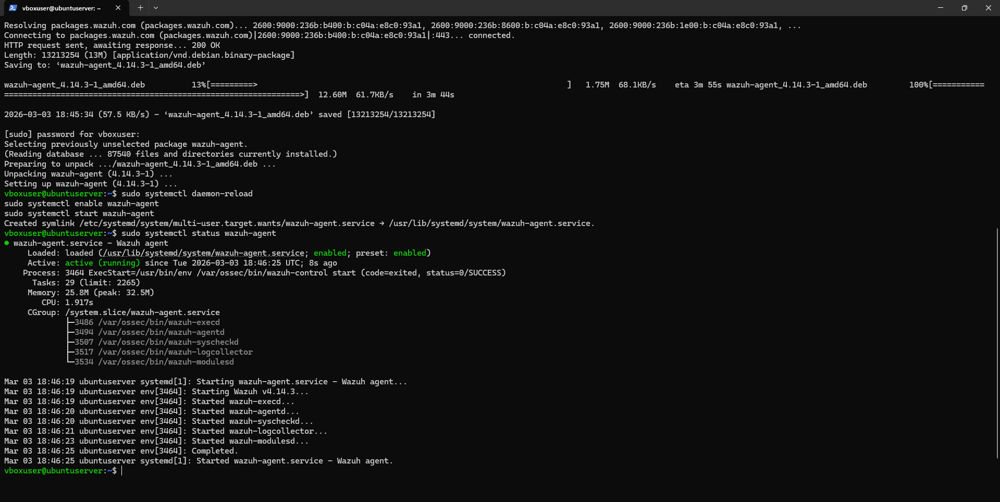
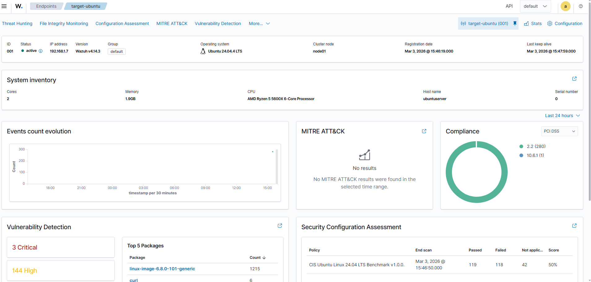
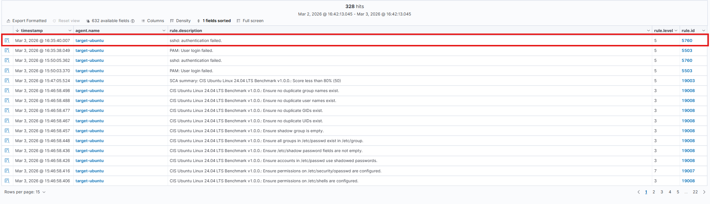
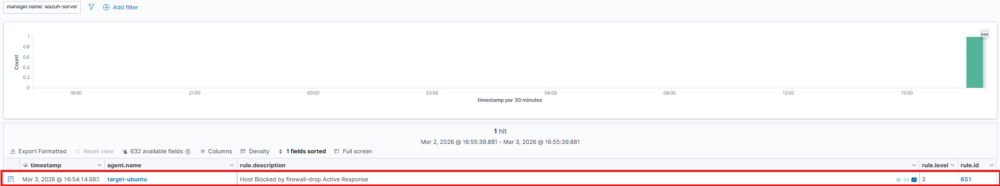
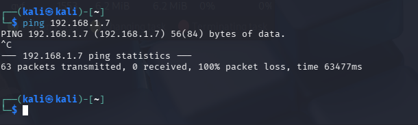
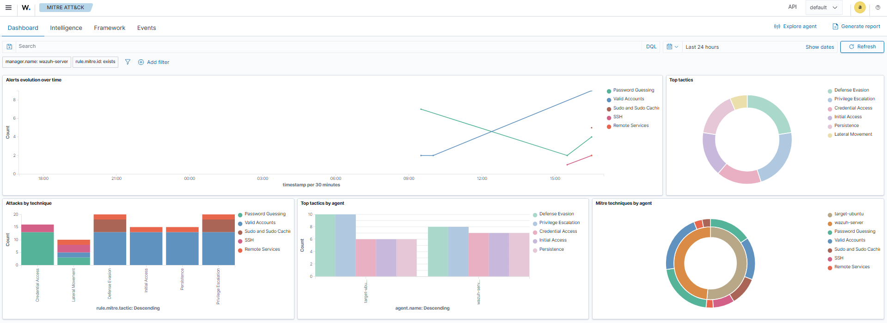

# 🛡️ SOC Lab: Detecção e Resposta Ativa com Wazuh SIEM

Este laboratório documenta a implementação de um ambiente de **Security Operations Center (SOC)** focado em monitoramento de endpoints e automação de defesa. O objetivo foi simular um cenário real de ataque de força bruta (Brute Force) e configurar o sistema para realizar a contenção automática do invasor via **Active Response**.

---

## 🏗️ Topologia do Ambiente
O laboratório foi montado em ambiente virtualizado (VirtualBox) utilizando rede em modo **Bridge** para permitir a comunicação direta entre as máquinas.

| Ativo | Sistema Operacional | Função | IP |
| :--- | :--- | :--- | :--- |
| **Wazuh Manager** | AlmaLinux 9 (v4.14.3) | SIEM/XDR - Cérebro do SOC | `192.168.1.6` |
| **Target-Ubuntu** | Ubuntu Server 24.04 LTS | Endpoint Monitorado (Vítima) | `192.168.1.7` |
| **Kali Linux** | Kali 2024.4 | Atacante (Red Team) | `192.168.1.8` |

*Interface principal do Wazuh v4.14.3 exibindo o resumo dos alertas de segurança.*

---

## ⚙️ Instalação e Configuração
Comecei o projeto instalando o **Wazuh Agent** no servidor Ubuntu. Isso garantiu a visibilidade total do sistema e permitiu o acompanhamento de logs e eventos em tempo real diretamente no Manager.

*Agente Wazuh instalado e operando em estado 'active (running)' no host de destino.*

*Visão detalhada do endpoint no SIEM, mostrando especificações de hardware e status de compliance.*

---

## ⚔️ Simulação de Ataque (Red Team)
Para testar a defesa, usei o **Hydra** para executar um ataque de **Brute Force** no protocolo SSH do servidor Ubuntu. O objetivo era tentar descobrir credenciais administrativas por tentativa e erro.

* **Tática MITRE ATT&CK:** Credential Access (T1110.001).
* **Execução:** O ataque gerou centenas de tentativas de login falhas, disparando os gatilhos de anomalia no SIEM.

---

## 🛡️ Detecção e Resposta (Blue Team)

### 1. Detecção de Intrusão
O SIEM correlacionou os logs de erro e detectou a tentativa de invasão, gerando alertas de severidade alta (Regra 5760).

*Logs de eventos indicando as múltiplas falhas de autenticação SSH.*

### 2. Contenção Automática (Active Response)
Para bloquear o ataque sem precisar de intervenção manual, configurei a **Active Response**. Assim que o Brute Force foi identificado, o Manager enviou uma ordem para o Ubuntu bloquear o IP do invasor no firewall local.

*O SIEM confirma a defesa automática: "Host Blocked by firewall-drop Active Response" (Regra 651).*

### 3. Verificação de Eficácia
Após o bloqueio, a conexão do Kali Linux (atacante) com o alvo foi totalmente cortada.

*Comando ping do atacante resultando em 100% de perda de pacotes após o banimento.*

---

## 📊 Mapeamento MITRE ATT&CK
Todo o incidente foi mapeado automaticamente no framework global, o que facilita a análise técnica das táticas utilizadas pelo adversário.

*Painel exibindo as técnicas detectadas, como 'Password Guessing' e 'Credential Access'.*

---

## 🧠 Habilidades Demonstradas
* Administração de **SIEM/XDR (Wazuh)**.
* Redução do **MTTR (Mean Time To Respond)** através de automação.
* Gestão de **Agentes de Segurança** e firewalls Linux (iptables).
* Análise de logs e mapeamento de ameaças via framework **MITRE ATT&CK**.

---

*Projeto desenvolvido como parte de estudos em Cibersegurança.*
